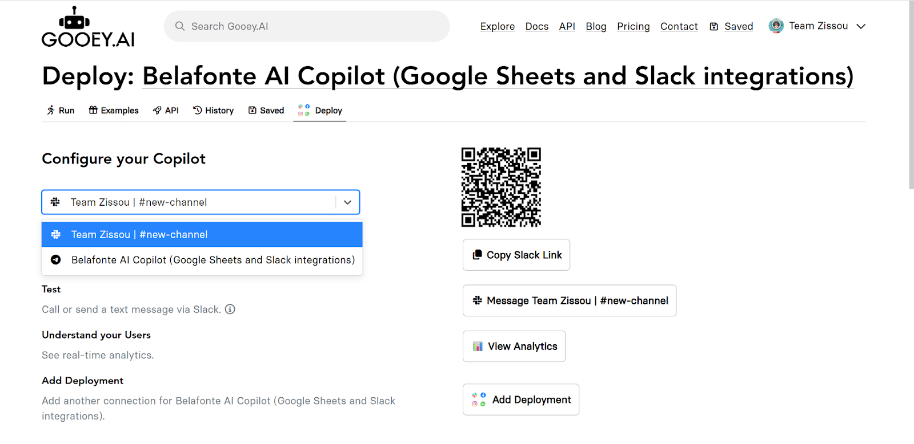

# Deploy to Telegram

## Deploy a Telegram bot&#x20;

### **Step 1:** Click on the ‘Deploy’ tab

### **Step 2:** Select ‘Add Deployment’.

>)

### **Step 3:** Select ‘Connect to Telegram’.

>)

### **Step 4:** Follow steps as instructed in the pop-up.

* Click on ‘Open BotFather’ and it will take you to its Telegram chat.

<figure><figcaption></figcaption></figure>

### **Step 5:** Follow the instructions on Telegram.

* Click ‘Start’ at the bottom of the chat.
* Type or select ‘/newbot’, then complete naming your bot. You will receive your token.
* Copy the token and go back to the ‘Deploy to Telegram’ page.

>) >)

### **Step 6:** Paste the token in the text box and click ‘Connect’.

<figure><figcaption></figcaption></figure>

### **Step 7:** Test your Telegram Bot&#x20;

* ‘Message _your bot name’._ This will take you to the bot’s Telegram chatroom.

<figure><figcaption></figcaption></figure>

* Click ‘Start’ at the bottom of the chat. Ask it a few questions.

>) >)

## Add a Telegram button your Saved RunStep 1: Head to Copilot Deploy tab

<figure><figcaption></figcaption></figure>

### Step 2: Click on the dropdown under ‘Configure your Copilot’&#x20;

* Find your deploment in the dropdown under ‘Configure your Copilot’&#x20;
* Select your bot with the Telegram logo to its left.

<figure><figcaption></figcaption></figure>

### **Step 3:** Click the ‘Show Telegram Button’.

* Scroll down and toggle the "Show Telegram Button".&#x20;

>)

### **Step 4:** Generate a QR code

* Click on ‘Generate’ to generate a QR code link to your Telegram bot (or upload your own), and hit ‘Save Settings’.

<figure><figcaption></figcaption></figure>

### **Step 5:** It’s time to test the bot!&#x20;

* If you head back to your "Run" or "Saved" Copilot you'll see a new "Telegram" button the top
* Click on the Telegram icon and use your QR code to start chatting up and testing your bot.

>)

<figure><figcaption></figcaption></figure>

