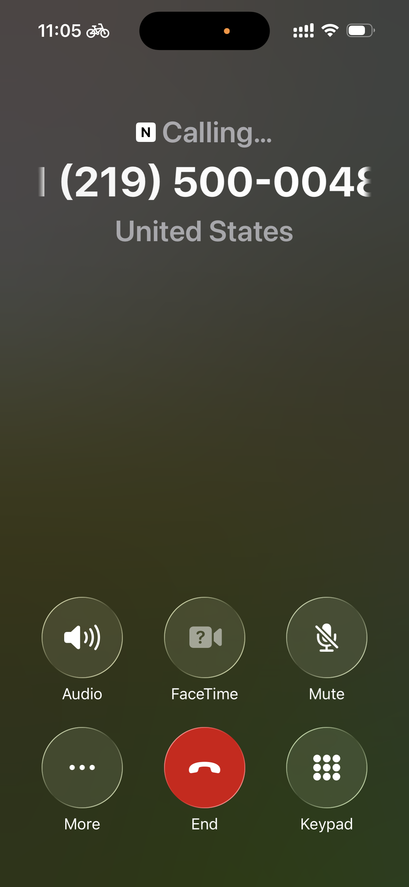

# Deploy to Voice

### **Step 1:** Click on the ‘Deploy’ tab

### **Step 2:** Select ‘Add Deployment’.

>)

### **Step 3:** Select ‘Voice & SMS’.

### **Step 4:** Test your Voice Agent

* Click on "Copy Phone Number" or "Start Voice Call" to test your Voice AI Agent

<figure><figcaption></figcaption></figure>

### 

### **Step 5:** Additional Settings

You can additional settings to enhance the expernece of the Voice Agent&#x20;

* **Initial Text**: A welcome message in a TTS voice can be played at the start of the call
* **Initial Audio**: A welcome message as a pre-recorded audio can be played at the start of the call
* **Waiting Audio:** A pre-recorded audio can be played when the user is waiting for a response
* **Waiting Text**: An SMS can be sent to the user when they are waiting for response
* **Use Missed Call**: Create a call back service for your users
* **Fresh Conversation History for Each Call**: If switched on Voice Agent will have no context of previous conversation history with the user

<figure><figcaption></figcaption></figure>

<figure><figcaption></figcaption></figure>

## Add a Voice Agent button your Saved Run

## Step 1: Head to Copilot Deploy tab

<figure><figcaption></figcaption></figure>

### Step 2: Click on the dropdown under ‘Configure your Copilot’&#x20;

* Find your deployment in the dropdown under ‘Configure your Copilot’&#x20;
* Select your bot with the Voice logo to its left.

<figure><figcaption></figcaption></figure>

### **Step 3:** Click the ‘Show Voice Button’.

* Scroll down and toggle the "Show Voice Button".&#x20;

### **Step 4:** Generate a QR code

* Click on ‘Generate’ to generate a QR code link to your Voice AI Agent (or upload your own), and hit ‘Save Settings’.

<figure><figcaption></figcaption></figure>

<figure><figcaption></figcaption></figure>

### **Step 5:** It’s time to test the bot!&#x20;

* If you head back to your "Run" or "Saved" Copilot you'll see a new "Voice" button the top
* Click on the Voice/SMS icon and use your QR code to start chatting up and testing your bot.

