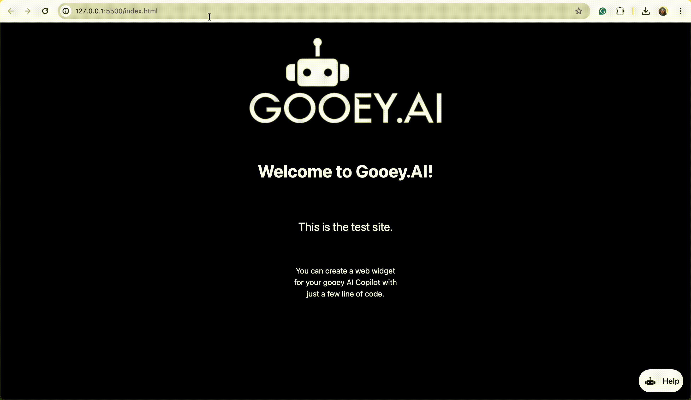

# Deploy to Web



## How to deploy on WEB

#### SET UP DEPLOYMENT CONFIG <a href="#wl0pcjbv3uj2" id="wl0pcjbv3uj2"></a>

1. Click on the Deployments tab
2. Use the “Gooey.AI” button


1. This will open the Web widget configuration page. You can add the following details:
   1. Name of the AI agent
   2. Description - this will be the introduction of the agent
   3. By line and website link
   4. Conversation Starters - add some introductory questions for the users


<figure><figcaption></figcaption></figure>

1. Hit Update
2. Test your agent here:
   1. Click on the “Message the Agent” button and test the agent.

#### EMBED TO WEBSITE <a href="#l71lp1y6w8k7" id="l71lp1y6w8k7"></a>

<figure><figcaption></figcaption></figure>

Once you are happy with the performance of the tests, you can Embed the agent in your production website with just two lines of code.

**Select Embed Settings**

.png>)

Use the “Embed Settings” to choose between “inline”, “pop-up” or “fullscreen” modes for your chat bot.

<figure><figcaption><p>Demo of pop-up AI Copilot</p></figcaption></figure>

<figure><figcaption><p>Demo of inline AI Copilot</p></figcaption></figure>

<figure><figcaption><p> Demo of fullscreen AI Copilot</p></figcaption></figure>

**Add the code to the website**

Copy the Embed code from the “Copy Embed Code” button and paste it into your website \`\`\`\<body\`\`\` tag.

.png>)

**EXAMPLE SNIPPET**


```html
<div id="gooey-embed"></div>
<script async defer onload="GooeyEmbed.mount()" src="https://gooey.ai/chat/the-gooeyai-bot-xxx/lib.js/"></script>
```



\`\`\`

Your AI AGENT is ready for the world! 😀

**Contact us at support@gooey.ai if you would like to connect your agent to a WhatsApp from Gooey.**
