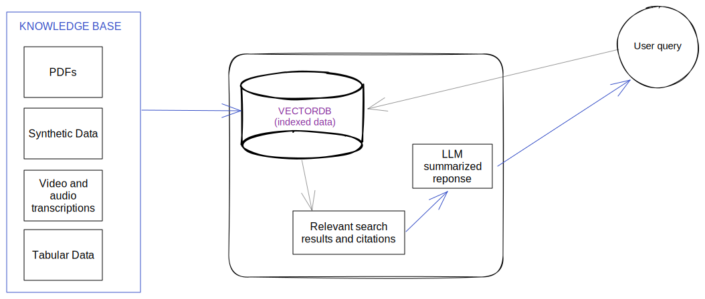

# How to build an AI Copilot?

## What is an AI Copilot?

An AI Copilot is a conversational chatbot that harnesses the abilities of modern AI models to summarize, make decisions and perform step-by-step analysis. With Gooey, it can be enhanced with custom knowledge documents, photo and document recognition, internet look-ups, speech recognition, integrations with WhatsApp, Facebook or your API to create incredible versatile tools.&#x20;

## Why do we need AI Copilot?

In practice, AI copilots and chatbots are generally useful at three broad functions: Increasing productivity (e.g. saving time), unlocking knowledge and helping users conversationally accomplish a task (e.g. TurboTax for Anything).&#x20;

Our approach with Gooey.AI is that we learn best when we can see work of others and hence, please check out [https://gooey.ai/copilot/examples](https://gooey.ai/copilot/examples).&#x20;

## What we offer

[Gooey.AI's Copilot](https://gooey.ai/copilot) is the most advanced chatbot maker in the industry. It offers:

* Selection of multiple [Large Language Models](https://gooey.ai/llm) (OpenAI GPT3.5, GPT4, GPT4-Turbo, GPT4-Vision, Meta's LLaMa2, Google PaLM2 and Gemini)
* Document OCR and Vision (examples: [simple](https://gooey.ai/copilot/?example\_id=v1xm6uhp), [BibleBot](https://gooey.ai/copilot/?example\_id=iiyv5ch7) and another that [fills out a form from photos](https://gooey.ai/copilot/?example\_id=n13jrsob))
* Integrations with Facebook, Slack, Whatsapp, Instagram and Websites (via landbot). Or publish your bot as API to integration into your own app.
* [Synthetic Data Extraction](prepare-synthetic-data.md) (e.g. to turn video transcripts into FAQs)
  * This allows you to transform both PDFs and videos into editable google sheets, with all the text/transcript extracted and optionally translated. Additionally, it allows you to build an automatic FAQ for each page, with citations given to the particular page number. We’ve found this dramatically improves search results.
* Built-in feedback buttons and [configurable conversation analysis](conversation-analysis.md)
* Retrieval Augmented Generation (with a Google doc, PDF, or Excel.) + advanced features  including:
  * Dense Embeddings&#x20;
  * Keyword Search Extraction - useful for highly technical knowledge bases with lots of jargon&#x20;
  * Conversation summarization - to create better vector DB queries
* [Speech Recognition & Translation](https://gooey.ai/speech) to understand incoming audio messages, powered by the latest models from Azure, Google, Meta, OpenAI and Bhashini.
* Language translations (including Google Translate, Bhashini, Seamless)
* Text-to-Speech from Google, Uberduck, and EvelenLabs (so the bot can send back audio responses)
* Video generation with[ LipSync with Text-to-Speech.](https://gooey.ai/lipsynctts)&#x20;
* Bulk Evaluation. With this you specify a set of test questions and golden answers and then the tool automatically compares and score competing versions of your bot.

## How it works?

Gooey.AI's Copilot uses the latest orchestration capabilities for Large Language Models. The general ability of LLMs is to summarize, analyze, and make decisions but it is NOT trained on your enterprise data. To overcome this, we are moving with an innovative and simple solution called <mark style="background-color:purple;">**Retrieval Augmented Generation**</mark>.&#x20;

#### What is Retrieval Augmented Generation?

Retrieval Augmented Generation (RAG) allows users to search indexed Domain Specific Information to ensure that LLMs provide the most accurate and up-to-date information about your enterprise needs.

Your data is prepared and indexed and when the user queries the AI Copilot searches and filters your data to the most relevant snippets. With the snippets and the system prompt, the LLM analyzes and summarizes an appropriate response to the user query.  This flow of information ensures that the AI Copilot:

1. Remains accurate and up-to-date&#x20;
2. It avoids hallucinating for a response
3. Do not respond to queries beyond the scope of your knowledge (unless you want it to). &#x20;
4. Mitigates risk to the organization
5. Builds users' trust by providing relevant information

#### How does RAG LLM work?

### REAL-WORLD OVERVIEW OF COPILOT VIA FARMER.CHAT

<figure><figcaption></figcaption></figure>

## How to build your copilot:

Gooey.ai offers a simple no-code UI to build RAG-based copilots in seconds. The interface is fairly intuitive and we encourage to you play with [our examples](https://gooey.ai/copilot/examples) and simply modify them.

If you would still like a step-by-step guide, please read through the sub-sections of this guide.&#x20;

This is the basic setup:

1. Relevant documents from your organization
2. A prompt script for the AI bot to follow
3. Hit Submit!&#x20;

<table data-view="cards"><thead><tr><th></th><th></th><th></th><th data-hidden data-card-target data-type="content-ref"></th></tr></thead><tbody><tr><td>Try Farmer.CHAT</td><td>An AI assistant to help farmers and farmer agents.</td><td></td><td><a href="https://gooey.ai/copilot/">https://gooey.ai/copilot/</a></td></tr><tr><td>Try Bank.CHAT</td><td>An example AI assistant to improve bank literacy.</td><td></td><td><a href="https://gooey.ai/copilot/?example_id=stpdnoyd">https://gooey.ai/copilot/?example_id=stpdnoyd</a></td></tr><tr><td>Copilot Guide Step 1: BEFORE you build a Bot</td><td></td><td></td><td><a href="what-to-do-before-you-build-a-bot.md">what-to-do-before-you-build-a-bot.md</a></td></tr></tbody></table>

