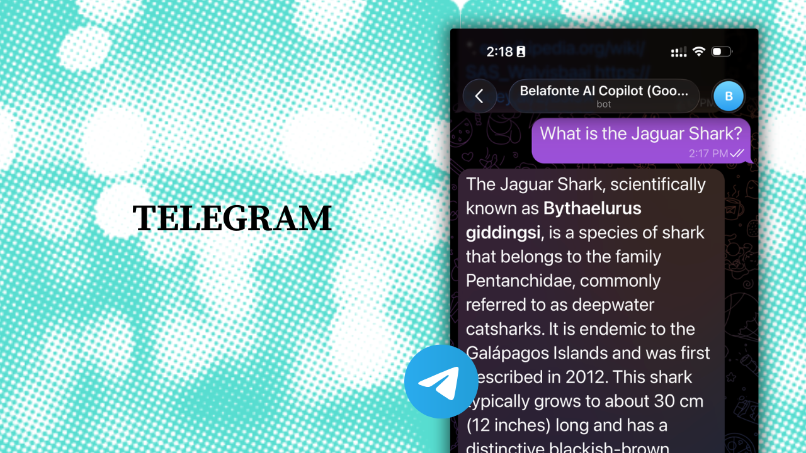

# Deploy on WhatsApp

## **How to deploy on WhatsApp** 

**Prerequisites**

* Verified Facebook business account
* A new or spare phone number for the WhatsApp bot

**Integration**

Click on the [Integrations tab](https://gooey.ai/copilot/integrations/) in the copilot workflow

* Use the “WhatsApp” button
* You’ll be redirected to Facebook Login Page
* Follow the instructions on the Facebook page

### Step 1 - Fill Business Information

<figure><figcaption></figcaption></figure>

### Step 2 - Choose your business account (or create a new one)

<figure><figcaption></figcaption></figure>

### Step 3 - Add a phone number for your Whatsapp bot&#x20;

<figure><figcaption></figcaption></figure>

### Step 4 - Verify the phone number

<figure><figcaption></figcaption></figure>

### **YOUR BOT IS NOW READY!**&#x20;

**Test**

You can test your bot by heading to the registered number!

**Share**

To share the link with others, share the number like this: [https://wa.me/](https://wa.me/)\<number>

#### Your COPILOT is ready for the world! 😀

**Contact us at support@gooey.ai if you would like to connect your bot to a WhatsApp from Gooey.**
