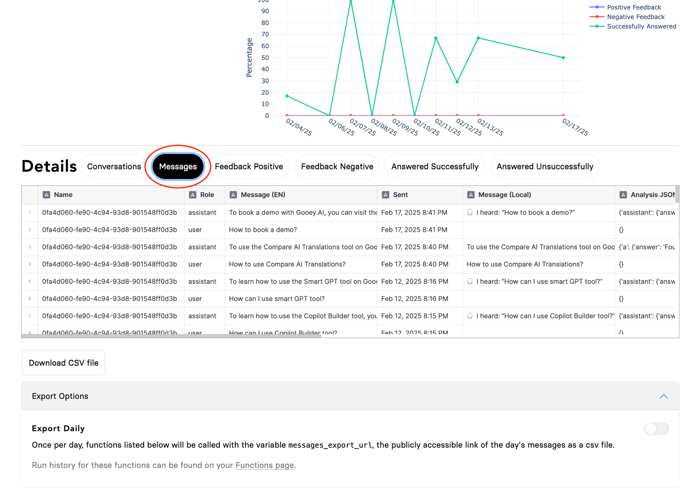

# How to add a “Daily Export” to export your Copilot data?

### Step 1

Head to the Integrations Tab of your AI Copilot, click on “View Analytics”

### Step 2

Once the Dashboard loads, head to the very bottom of the page and open the “Export Settings” tab.

<figure><figcaption></figcaption></figure>

### Step 3

You can add a code snippet through “Functions”, which can export the data to any external DB.

### Step 4

Click the relevant Function from the drop-down and hit “Save”


NOTE: The export will only work in the messages tab. The “Messages” section is in the “Details” section as per the screenshot below.



TIP: You can also trigger a run, whenever you need with the "Run Now" button


<figure><figcaption></figcaption></figure>

