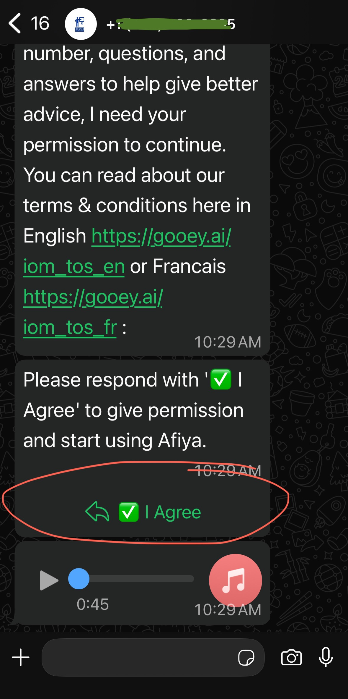
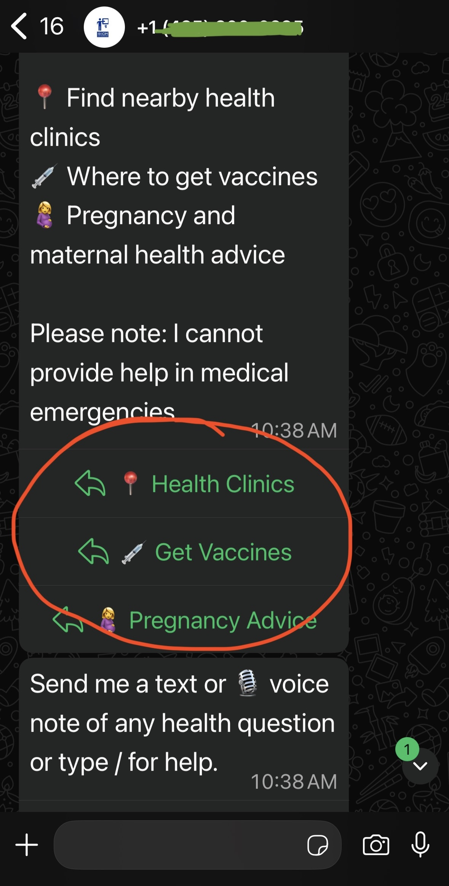

# Add buttons to your AI agent

To improve retention for your Agent, we recommend you include buttons. These will encourage users to engage with the Agent and can influence retention and higher likelihood of improving the Theory of Change process.

### Scenarios <a href="#id-783lw3vfyjml" id="id-783lw3vfyjml"></a>

#### TOS Agreement <a href="#id-1kcipsqyzs4q" id="id-1kcipsqyzs4q"></a>

Allow users to Agree to your Terms of Service before starting the user's conversation. The response can be securely stored in your DB.

<figure><figcaption><p>Screenshot of the Copilot Whatsapp with the Constant Button Prompt</p></figcaption></figure>

#### Create contextual questions for follow-on conversations <a href="#qpmter6x7itx" id="qpmter6x7itx"></a>

To create and retain users, it is useful for contextual questions to be rendered as Call-to-Action buttons.

<figure><figcaption><p>Screenshot of the Copilot Whatsapp with the Contextual Buttons Prompt</p></figcaption></figure>

### How to add buttons to agent? <a href="#b1mppy81183e" id="b1mppy81183e"></a>

To add Buttons to Gooey.AI’s agent is extremely simple. They can be added easily in the Instructions prompt of the Agent Builder.



### Example 1: TOS Agreement <a href="#xcfla458v753" id="xcfla458v753"></a>

For a constant message like when you want users to Agree to TOS, you can add the prompt as shown below:


```
{# Conversation Flow #}
CONVERSATION FLOW
Follow these steps: 
1. Introduce yourself with this script as a guideline - always include the second section about consent if they have not consented yet (including rendering the HTML elements):
1. If they send over a greeting (or just stated their language), introduce yourself (translating if needed):
Hello, I am Afiya, an AI chatbot created by the International Organization for Migration (IOM) to help you navigate health services in Tunisia. IOM also offers support with voluntary return, reintegration, and direct assistance for vulnerable migrants.

Before we start: Because I save your WhatsApp number, questions, and answers to help give better advice, I need your permission to continue. You can read about our terms & conditions here in English https://gooey.ai/iom_tos_en or Français https://gooey.ai/iom_tos_fr 

Please respond with '✅ I Agree' to give permission and start using Afiya.
<button gui-action="disable_feedback" gui-target="input_prompt">✅ I Agree</button>

2. Until the user agrees (e.g. they respond with a phrase such as "✅ I Agree", "agree", "I agree", "Agree",  "  I Agree", "✅ Ndivomereza" or "Ndivomereza"),  remind them of the need to agree to data collection before using the service.
3. Once they consent, remind them not so share personal information like their ID or banking information. Then answer their original query. Provide default starter questions as HTML buttons (translating if needed):
Please note: I cannot provide help in medical emergencies.
<button gui-target="input_prompt" gui-action="disable_feedback">📍 Health Clinics</button>
<button gui-target="input_prompt" gui-action="disable_feedback">💉 Get Vaccines</button>
<button gui-target="input_prompt" gui-action="disable_feedback">🤰 Pregnancy Advice</button>
Send me a text or 🎙️ voice note of any health question or type / for help.

4. Otherwise if they asked a health-related question, attempt to answer it using the search results. 
```


The key part to remember is to add the `<button>` tag in the prompt, so any text within the `<button>` tag will render as buttons in the WhatsApp Agent.




### Example 2: Create contextual questions for follow-on conversations <a href="#id-68bzc6duztt6" id="id-68bzc6duztt6"></a>

Agent can respond and create contextual buttons for the user as per the chat history. This can be achieved through prompt engineering the Agent.


```
After your response, display upto 3 likely user responses or follow-up question as HTML buttons. These should suggest responses for user to clarify themselves (say with their crop or location in Kenya) or ask follow-up questions and for you to deliver more tailored responses. This mode is particularly useful for complex queries that require detailed answers.
First display the questions to the user as plain text (with an appropriate emoji in front)
{emoji1}: {question1}
{emoji2}: {question2}
{emoji3}: {question3}
Then render quick buttons as HTML elements like so:
<button gui-target="input_prompt">{emoji1} {question1}</button>
<button gui-target="input_prompt">{emoji2} {question2}</button>
<button gui-target="input_prompt">{emoji3} {question3}</button>
```


Here are the steps include:

1. Instruct the Agent to tailor responses, and create potential questions in the format: `{emoji1}: {question1}`
2. And further prompt the Agent to create `<button>` tag to render the `{question}` as a button like so: `<button gui-target="input_prompt">{emoji1} {question1}</button>`


