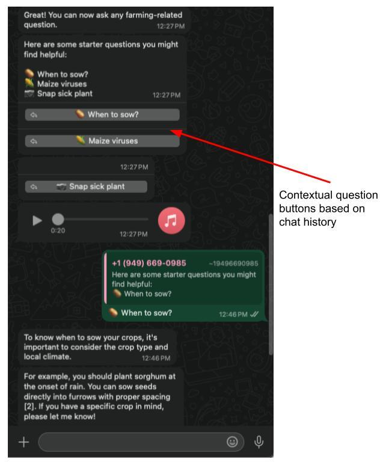

# How to add buttons to your Copilot

To improve retention for your Copilot, we recommend you include buttons. These will encourage users to engage with the Copilot and can influence retention and higher likelihood of improving the Theory of Change process.

### Scenarios <a href="#id-783lw3vfyjml" id="id-783lw3vfyjml"></a>

#### TOS Agreement <a href="#id-1kcipsqyzs4q" id="id-1kcipsqyzs4q"></a>

Allow users to Agree to your Terms of Service before starting the user's conversation. The response can be securely stored in your DB.

<figure><figcaption><p>Screenshot of the Copilot Whatsapp with the Constant Button Prompt</p></figcaption></figure>

#### Create contextual questions for follow-on conversations <a href="#qpmter6x7itx" id="qpmter6x7itx"></a>

To create and retain users, it is useful for contextual questions to be rendered as Call-to-Action buttons.

<figure><figcaption><p>Screenshot of the Copilot Whatsapp with the Contextual Buttons Prompt</p></figcaption></figure>

### How to add buttons to Copilot? <a href="#b1mppy81183e" id="b1mppy81183e"></a>

To add Buttons to Gooey.AI’s copilot is extremely simple. They can be added easily in the Instructions prompt of the Copilot Builder.



#### Example 1: TOS Agreement <a href="#xcfla458v753" id="xcfla458v753"></a>

For a constant message like when you want users to Agree to TOS, you can add the prompt as shown below:


```
Please tap 'I agree' to let us know you understand what data we collect and to ask any farming related question.
<button gui-target="input_prompt">I agree</button>
```


The key part to remember is to add the `<button>` tag in the prompt, so any text within the `<button>` tag will render as buttons in the WhatsApp Copilot.

.png>)

#### Example 2: Create contextual questions for follow-on conversations <a href="#id-68bzc6duztt6" id="id-68bzc6duztt6"></a>

Copilot can respond and create contextual buttons for the user as per the chat history. This can be achieved through prompt engineering the Copilot.


```
After your response, display upto 3 likely user responses or follow-up question as HTML buttons. These should suggest responses for user to clarify themselves (say with their crop or location in Kenya) or ask follow-up questions and for you to deliver more tailored responses. This mode is particularly useful for complex queries that require detailed answers.
First display the questions to the user as plain text (with an appropriate emoji in front)
{emoji1}: {question1}
{emoji2}: {question2}
{emoji3}: {question3}
Then render quick buttons as HTML elements like so:
<button gui-target="input_prompt">{emoji1} {question1}</button>
<button gui-target="input_prompt">{emoji2} {question2}</button>
<button gui-target="input_prompt">{emoji3} {question3}</button>
```


Here are the steps include:

1. Instruct the Copilot to tailor responses, and create potential questions in the format: `{emoji1}: {question1}`
2. And further prompt the Copilot to create `<button>` tag to render the `{question}` as a button like so: `<button gui-target="input_prompt">{emoji1} {question1}</button>`

.png>)
