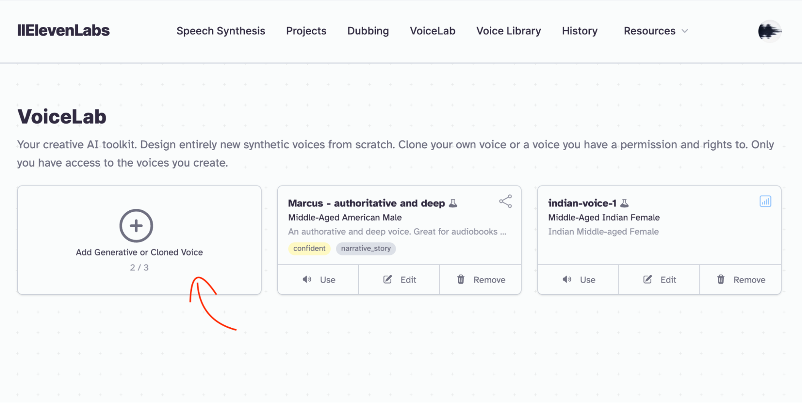
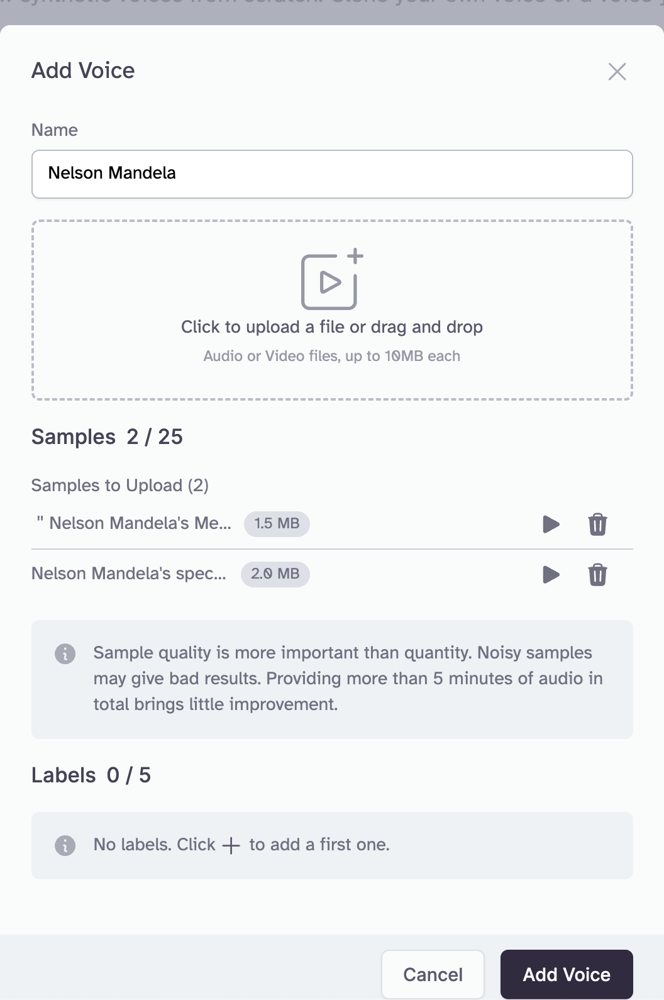
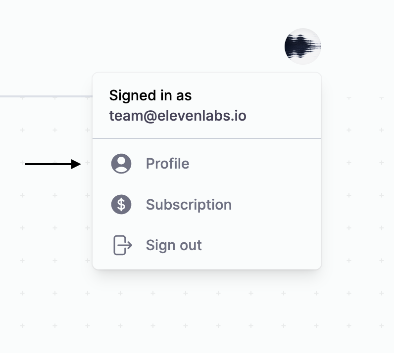
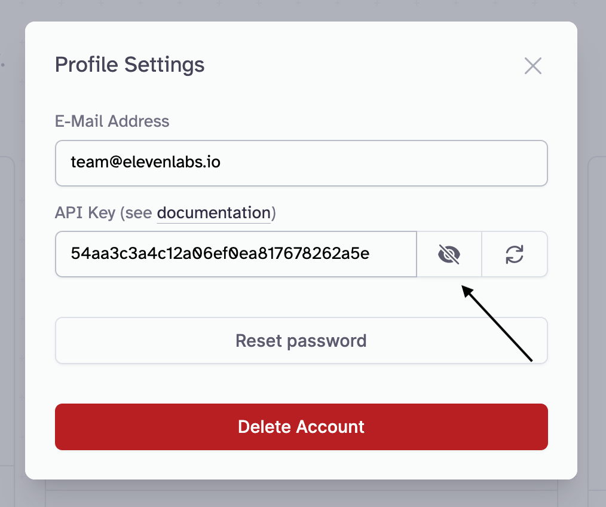
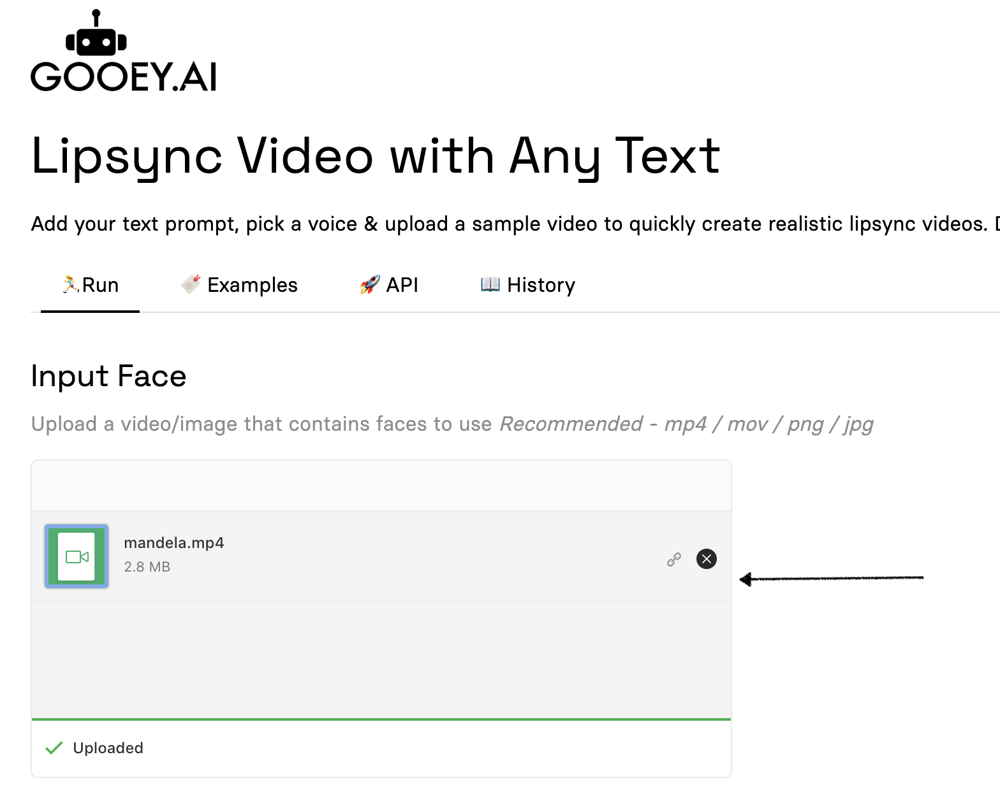
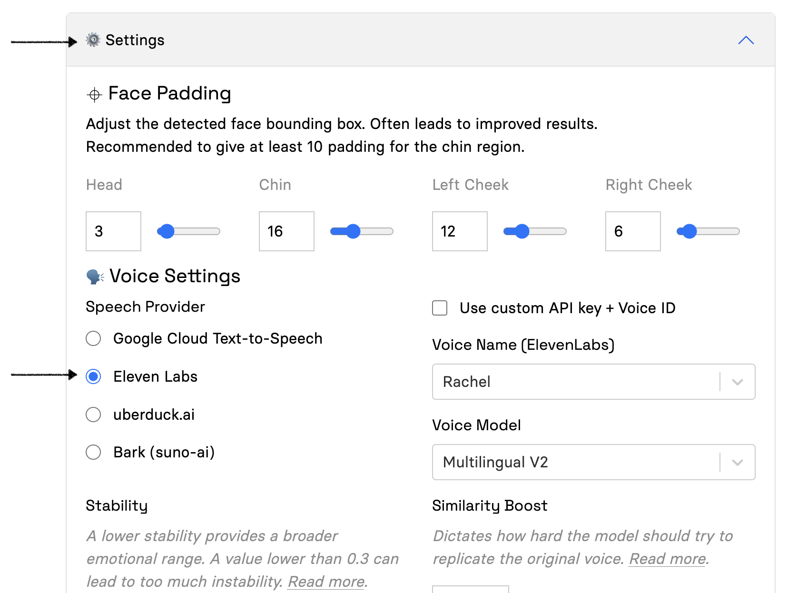
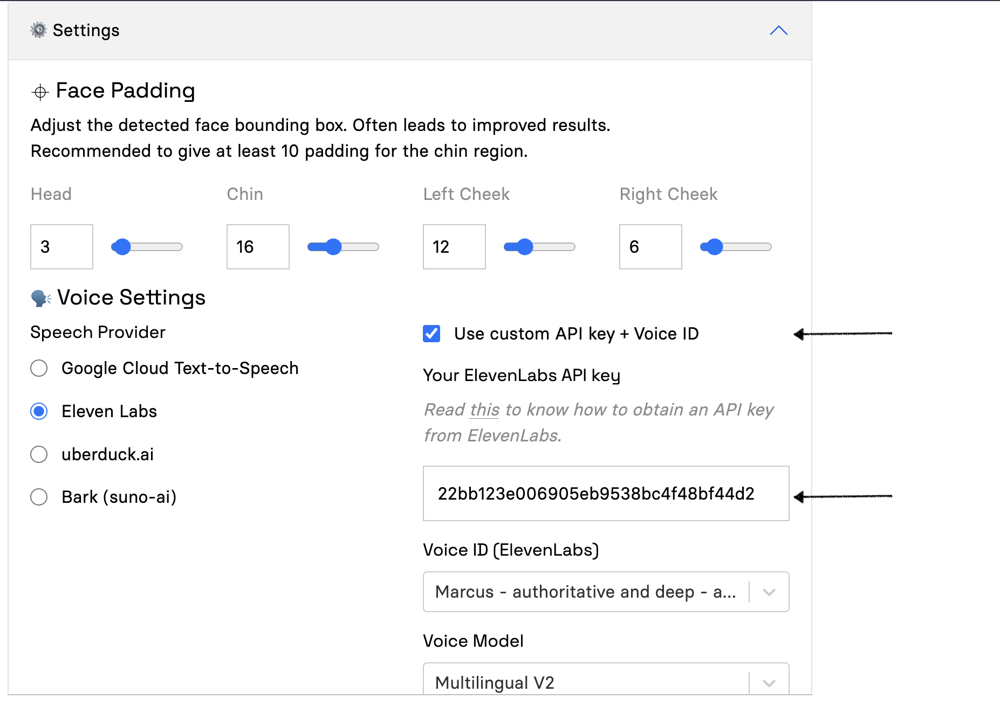
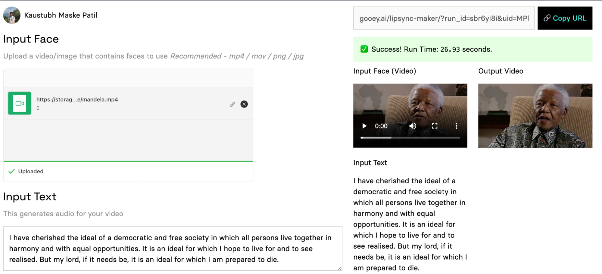

# LipSync videos with Custom Voices

Generating lipsync’d videos is amazing and they are even better with a custom voice. Companies like ElevenLabs enable you to create custom voices by uploading voice samples and we are very happy to announce that you can now use your custom [ElevenLabs](https://www.google.com/url?q=https://elevenlabs.io/\&sa=D\&source=editors\&ust=1699647828894323\&usg=AOvVaw2bAzAdEO-4xNhkycFFBZum) voice inside of the Gooey.AI [Lipsync Maker](https://www.google.com/url?q=https://gooey.ai/lipsync-maker/\&sa=D\&source=editors\&ust=1699647828894585\&usg=AOvVaw09k8ytfRSZQzN\_aTYdqkZ\_) (and [Copilot](https://www.google.com/url?q=https://gooey.ai/copilot\&sa=D\&source=editors\&ust=1699647828894767\&usg=AOvVaw2lj194DVdC8sAuYPSw2Oz5)) Workflows.

### Step 0 - Sign up on Eleven Labs 

Sign up on Eleven Labs: [https://elevenlabs.io/sign-up](https://www.google.com/url?q=https://elevenlabs.io/sign-up\&sa=D\&source=editors\&ust=1699647828895148\&usg=AOvVaw0h5Bqecq34c4s5Qy5hE\_tq)

### Step 1 - Add a custom voice in Eleven Labs 

Go to the Voice Lab section ([https://elevenlabs.io/voice-lab](https://www.google.com/url?q=https://elevenlabs.io/voice-lab\&sa=D\&source=editors\&ust=1699647828895474\&usg=AOvVaw2ducMm00V46WhXMxHHo0hn)) and click on “Add Generative or Cloned Voice”

You will be shown multiple options for where to generate the new voice from. As of now, they generated voices and community voices for free users. They offer Instant Voice Cloning and Professional Voice Cloning for their subscribers.

Generated voices are created by adjusting parameters such as gender, age, and accent. This doesn’t take audio samples, and so it might not be exactly like you had imagined.

Community voices are those made publicly available by other users. Eleven Labs does have a good collection of community voices but you might not find exactly what you are looking for.

If you subscribe for their lowest paying tier that costs $5 / month, you can make use of Instant Voice Cloning to extract a voice from audio samples within seconds. We’ll use this to create a clone of Nelson Mandela’s voice, so we can recreate his speeches from text.

For our use case, we converted two of his interview clips – [Nelson Mandela’s special message to INTERPOL 75th General Assembly](https://www.google.com/url?q=https://www.youtube.com/watch?v%3D5W09lWOBDxg\&sa=D\&source=editors\&ust=1699647828896531\&usg=AOvVaw2wSpSVTNXdNCH6tfuhawmt) and [“Nelson Mandela’s message to BFS”](https://www.google.com/url?q=https://www.youtube.com/watch?v%3DI76k1um2hoc\&sa=D\&source=editors\&ust=1699647828896710\&usg=AOvVaw38V3GHLnDQKRQSbDpoDYTP) – to mp3 format, and uploaded them in the Eleven Labs instant voice cloning interface.

We agree to the

Note: there is more to know about the kinds of custom voices and you can visit their [VoiceLab documentation](https://www.google.com/url?q=https://elevenlabs.io/docs/voicelab/overview\&sa=D\&source=editors\&ust=1699647828897213\&usg=AOvVaw18T8Yi9evuUHf1pTsX\_1Sd) to know more about it.

### Step 2 - Copy API key from Eleven Labs 

On the Eleven Labs website, click on the profile icon in the top right corner, and select the Profile option.

This will open up the Profile Settings and show you the API key. Make it visible and copy it to use in Gooey.

Source for these images is the [Eleven Labs documentation](https://www.google.com/url?q=https://elevenlabs.io/docs/api-reference/authentication\&sa=D\&source=editors\&ust=1699647828897969\&usg=AOvVaw0y8f8sDJ4jis-Wo40r1dZO).

### Step 3 - Use it on Gooey’s Lip Sync with Text recipe 

Visit the workflow page for [LipSync with Text](https://www.google.com/url?q=https://gooey.ai/lipsync-maker/\&sa=D\&source=editors\&ust=1699647828898341\&usg=AOvVaw0BKZHky5I4ILHdjHunuizB) and add a video or image you want to extract the face from in “Input Face”. You will need to remove the default uploaded file and upload your own video or image file.

<figure><figcaption></figcaption></figure>

Open the “Settings” dropdown, and in “Voice Settings”, set the “Speech Provider” to “Eleven Labs”.

&#x20;

<figure><figcaption></figcaption></figure>

Select the checkbox that says “Use custom API key + Voice ID” and enter the copied API key into the field that says “Your Eleven Labs API Key”

<figure><figcaption></figcaption></figure>

This should fetch all the available voices from your account into the “Voice ID” field.

Choose the voice that you want to run in the Voice ID field. In our case it is the voice we added in Eleven Labs with the name “Nelson Mandela”, we select that.

Now we can copy some text from his 1964 speech, [“I am Prepared to Die”](https://www.google.com/url?q=https://en.wikipedia.org/wiki/I\_Am\_Prepared\_to\_Die\&sa=D\&source=editors\&ust=1699647828899397\&usg=AOvVaw3EeZ9pFuWTonUyKj22pp0L), and add it into the “Input Text” field.

We hit “Submit” and voila! We get an accurate sounding version of the speech with a newer photo.

<figure><figcaption></figcaption></figure>

This is the run URL if you want to tweak and explore more: [https://gooey.ai/lipsync-maker/?run\_id=sbr6yi8i\&uid=MPhrEpmVYkept8yJjsBzJPL0Tuj1](https://www.google.com/url?q=https://gooey.ai/lipsync-maker/?run\_id%3Dsbr6yi8i%26uid%3DMPhrEpmVYkept8yJjsBzJPL0Tuj1\&sa=D\&source=editors\&ust=1699647828899919\&usg=AOvVaw2A-\_rSFe1Rs1ra4J3eZ1s3)

There are more Eleven Labs options that you can explore in the Gooey dashboard, such as the model to use and the voice settings. You can play around with them on [Gooey](https://www.google.com/url?q=https://gooey.ai/lipsync-maker/\&sa=D\&source=editors\&ust=1699647828900220\&usg=AOvVaw2tJibimDj6RBJKIWVAyphB) and learn more about how to use them effectively from the [Eleven Labs documentation](https://www.google.com/url?q=https://elevenlabs.io/docs/speech-synthesis/voice-settings\&sa=D\&source=editors\&ust=1699647828900392\&usg=AOvVaw22TvmgLNfc85GpUiRKevmc).
