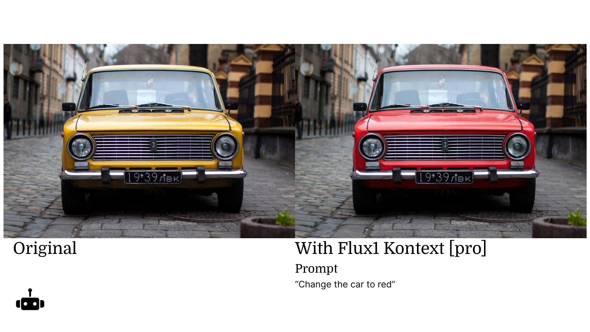

# Google Translate Glossary

These sheets contain the glossary information for Google Translate translations on gooey.ai. Please be careful when updating the sheets since it is possible to break translations with incorrect syntax. It is best to copy and paste complete changes into Glossary.sheets (i.e. one row/column at a time). See an example glossary [here](https://docs.google.com/spreadsheets/d/1IRHKcOC86oZXwMB0hR7eej7YVg5kUHpriZymwYQcQX4/edit#gid=0).

### Glossary.sheet 

This sheet contains the glossary terms. The first row should be [ISO-639](https://wikipedia.org/wiki/ISO\_639) or [BCP-47](https://tools.ietf.org/html/bcp47) language codes. Two extra columns are allowed: “pos” to specify part of speech and “description” (these columns are currently ignored by the Google Translate API but may be used in the future):

<figure><figcaption></figcaption></figure>

Each subsequent row is then one glossary term in multiple languages. Read more [here](https://cloud.google.com/translate/docs/advanced/glossary#translate\_v3\_translate\_text\_with\_glossary-drest). Changes made to this file are automatically uploaded to a Google Cloud Bucket to be used as a translation Glossary in gooey-server Google Translate requests.

**Notes**:

* By default, each glossary term is not case-sensitive. This parameter can be changed in the gooey-server code.
* Glossary entries for stopwords are[ignored by the Google Translate API](https://cloud.google.com/translate/docs/advanced/stopwords)
