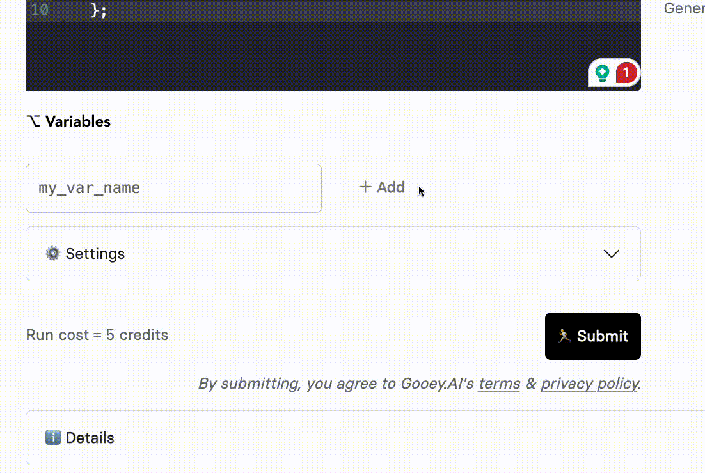

# 🧩 How to use Gooey Functions?

In this guide, we will look at the steps of creating a functions call on Gooey.AI and adding it to our Gooey.AI workflows.&#x20;

### **Step 1**

Head over the [Functions workflow](https://gooey.ai/functions/)

### **Step 2**

Create your POST Request with AFTER Function


```javascript
async (variables) => {
  const res = await fetch("https://httpbin.org/post", {
    method: "POST",
    body: JSON.stringify(variables),
    headers: {
      "Content-Type": "application/json",
    },
  });
  return { response: await res.json() };
};
```


**Currently, we have added httpbin for our POST request, you can change this for your preferred API.**

<figure><figcaption></figcaption></figure>

### **Step 3**

Add your relevant variables

<figure><figcaption></figcaption></figure>

### **Step 4**

Hit Submit, if your code is working fine. Use the “Save as New” button and update the run name.

<figure><figcaption></figcaption></figure>

### **Step 5**

Now head over to the Gooey workflow where you want to add the saved functions.

Head over to the example below:&#x20;



<figure><figcaption></figcaption></figure>

Check the Functions, choose “AFTER” and add your Saved example. And then hit "SUBMIT!&#x20;

<figure><figcaption></figcaption></figure>

You can check your Functions output in the Workflow at the end of the page in "Details" section.&#x20;

<figure><figcaption></figcaption></figure>

### How do I find all the available functions and how can I contribute? <a href="#id-86mplbjxoi5t" id="id-86mplbjxoi5t"></a>

All the functions are available here:



Choose any of the Examples and Fork them!

<figure><figcaption></figcaption></figure>
