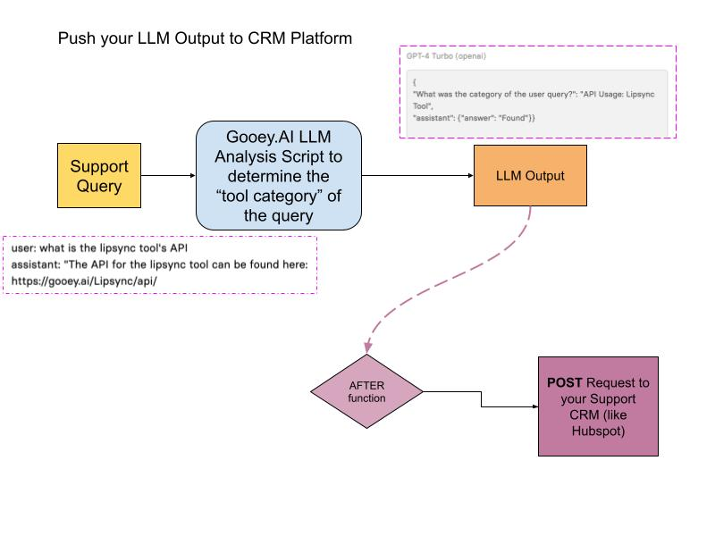
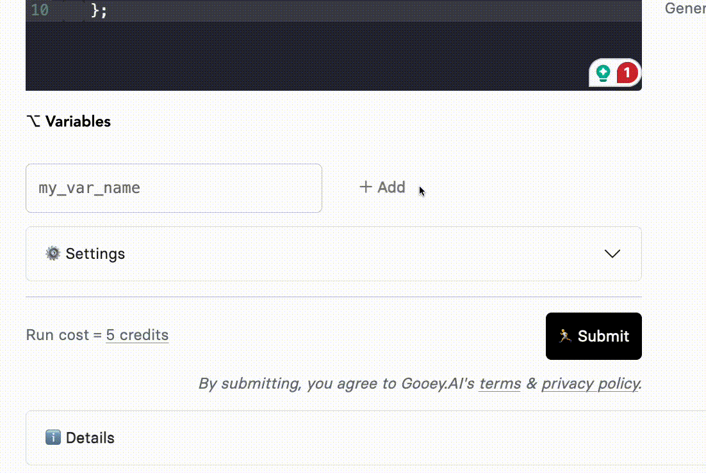
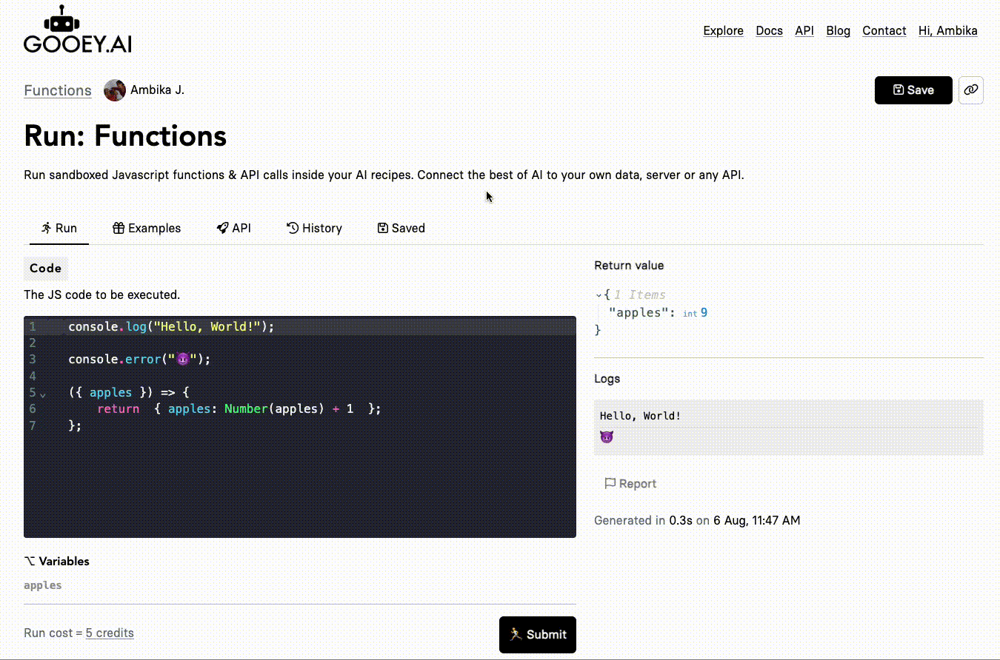

# 🧩 How to use Gooey Functions?

In this guide, we will learn how to create a functions call on Gooey.AI and add it to our Gooey.AI workflows.&#x20;

We'll take the example of our Copilot Analysis Scripts. All copilots have an integrated LLM script to analyze various user data. This could be user location, question category, user sentiment, etc. Once you have the data, you might want to push it to your servers, or database, or combine it with your other services.&#x20;

### Scenario

We will take the "Gooey Chat Bot Analysis Script" in this example. This LLM script analyzes the incoming messages to our [Gooey.AI Support Bot](https://gooey.ai/copilot/the-gooeyai-support-bot-3dwfcqvcwl04/) and categorizes the user's query into buckets like API Usage, Pricing, Sales, etc.&#x20;

We want to push this output to our CRM so we get deeper analytics which helps us respond better to our customers.&#x20;

<figure><figcaption></figcaption></figure>

<figure><figcaption><p>Gooey Support Bot's Analysis script, on the left is the LLM prompt with the incoming message and on the right is the category output</p></figcaption></figure>


LINK TO THE LLM ANAYLSIS SCRIPT


## How do you add functions to your Gooey workflows?

### **Step 1**

Head over the [Functions workflow](https://gooey.ai/functions/)

### **Step 2**

Create your POST Request with AFTER Function:

Here is a basic fetch call, you can copy or edit this code as per your needs, and paste it in the code editor on the Functions workflow.&#x20;

**Currently, we have added httpbin for our POST request, you can change this for your preferred API. You can find more** [**examples here**](https://gooey.ai/functions/examples)


```javascript
async (variables) => {
  const res = await fetch("https://httpbin.org/post", {
    method: "POST",
    body: JSON.stringify(variables),
    headers: {
      "Content-Type": "application/json",
    },
  });
  return { response: await res.json() };
};
```


<figure><figcaption><p>Functions workflow with the code editor to the left</p></figcaption></figure>

### **Step 3**

Add your relevant variables.&#x20;

<figure><figcaption></figcaption></figure>

### **Step 4**

Hit Submit, if your code is working fine you will get your outputs on the right side. Use the “Save as New” button and update the run name.

<figure><figcaption></figcaption></figure>

### **Step 5**

Now head over to the Gooey workflow where you want to add the saved functions.

Head over to the example below:&#x20;



<figure><figcaption></figcaption></figure>

Check the Functions, choose “AFTER” and add your Saved example. And then hit "SUBMIT!&#x20;

<figure><figcaption></figcaption></figure>

You can check your Functions output in the Workflow at the end of the page in "Details" section.&#x20;

<figure><figcaption></figcaption></figure>

### How do I find all the available functions and how can I contribute? <a href="#id-86mplbjxoi5t" id="id-86mplbjxoi5t"></a>

All the functions are available here:



Choose any of the Examples and Fork them!

<figure><figcaption></figcaption></figure>

### More resources

<table data-view="cards"><thead><tr><th></th><th data-hidden data-card-target data-type="content-ref"></th><th data-hidden data-card-cover data-type="files"></th></tr></thead><tbody><tr><td><h4>Read more about GOOEY.AI functions</h4></td><td><a href="https://app.gitbook.com/s/leYcqBx5FRZcVr3wI4f4/fun-fun-functions">Fun fun functions!</a></td><td><a href="../../.gitbook/assets/gooey.ai - cute robot doing javascript vintage p...gazine advertisement muted colorful illustration.png">gooey.ai - cute robot doing javascript vintage p...gazine advertisement muted colorful illustration.png</a></td></tr><tr><td><h4>Connect API to LLM Generator</h4></td><td><a href="https://gooey.ai/compare-large-language-models/functions-make-a-haiku-with-iss-coordinates-k4vuehh6hhvo/">https://gooey.ai/compare-large-language-models/functions-make-a-haiku-with-iss-coordinates-k4vuehh6hhvo/</a></td><td><a href="../../.gitbook/assets/gooey.ai - cute robots and aliens shaking hands ...gazine advertisement muted colorful illustration.png">gooey.ai - cute robots and aliens shaking hands ...gazine advertisement muted colorful illustration.png</a></td></tr><tr><td></td><td></td><td></td></tr></tbody></table>
