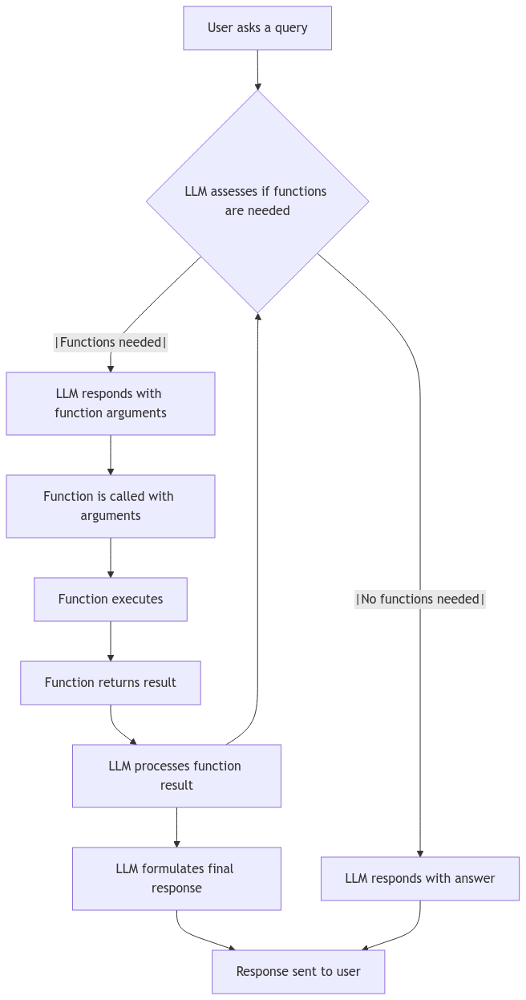

# ✨ LLM-enabled Functions

## Where are LLM-enabled Functions useful?

There are many scenarios where we don't need to run the Functions for every Copilot query. For example:

* User wants to calculate data in between the conversation (like an HVAC CFM Calculation)
* LLM needs to do a Google search to respond to the query
* LLM needs to do a look-up weather API and answer the query&#x20;

<figure><figcaption><p>A flowchart which shows the different flows </p></figcaption></figure>

## How do LLM-enabled Functions work?

When the user sends a query in Natural Language, the LLM determines the following:&#x20;

1. does the query require a function?
2. which part of the text should be passed as an argument in the function?

In the example below, the query is about CFM calculations which are commonly used in HVAC installations.&#x20;

<figure><figcaption></figcaption></figure>

## How to use LLM-enabled Functions?

Using LLM-enabled Functions is exactly the same as "BEFORE" and "AFTER" functions

### **Step 1** <a href="#step-1" id="step-1"></a>

Head over the [Functions workflow](https://gooey.ai/functions/)

### **Step 2** <a href="#step-2" id="step-2"></a>

Create your PROMPT Function:

* create a basic fetch call for the weather of any location
* create a serper&#x20;

**You can find more** [**examples here**](https://gooey.ai/functions/examples)

#### A basic Weather API call ([link here](https://gooey.ai/functions/current-weather-rxmquy60p1vq/))

```javascript
async ({ lat, long }) => {
  // Use Open-Meteo's public API for fetching weather data
  let url = `https://api.open-meteo.com/v1/forecast?latitude=${lat}&longitude=${long}&current_weather=true`;
  let response = await fetch(url);
  let data = await response.json();
  return { weather: data.current_weather };
};
```

#### An API call for serper  - a service for google search ([link here](https://gooey.ai/functions/google-search-without-api-key-tey6zrx2vzvm/))

```javascript
async ({ query }) => {
  var myHeaders = new Headers();
  myHeaders.append("X-API-KEY", "your API key");
  myHeaders.append("Content-Type", "application/json");
  
  var raw = JSON.stringify({
    "q": query
  });
  
  var requestOptions = {
    method: 'POST',
    headers: myHeaders,
    body: raw,
    redirect: 'follow'
  };
  
  let ret = await fetch("https://google.serper.dev/search", requestOptions);

  return { search_results: await ret.json() };
};

```

#### **Step 3** <a href="#step-3" id="step-3"></a>

Hit Submit, if your code is working fine you will get your outputs on the right side. Use the “Save as New” button and update the run name.

#### **Step 4** <a href="#step-5" id="step-5"></a>

Now head over to the Gooey workflow where you want to add the saved functions.

Head over to the example below:



Check the Functions option, and choose “PROMPT” from the dropdown and add your Saved example. And then hit "SUBMIT!

<figure><figcaption></figcaption></figure>

_You can check your Functions output in the Workflow at the end of the page in "Details" section._

<figure><figcaption></figcaption></figure>

<figure><figcaption></figcaption></figure>

