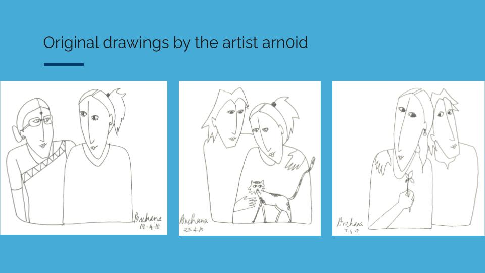
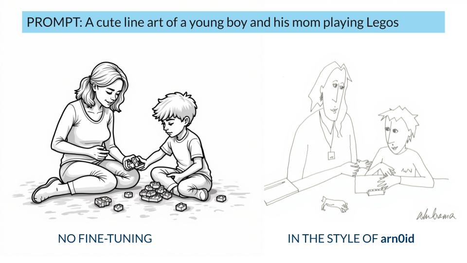
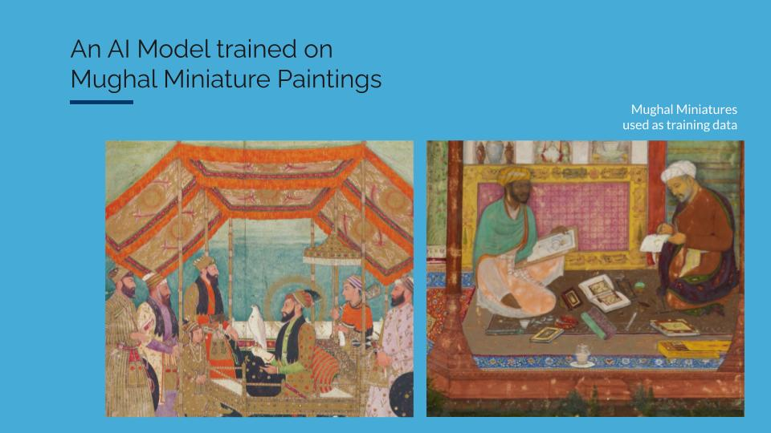
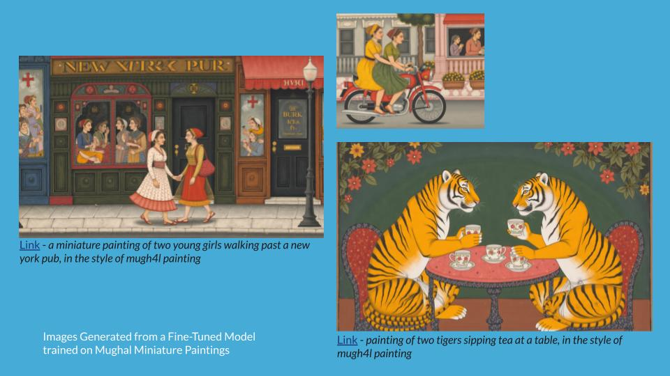

# 🧑‍🏫 How to use Gooey.AI’s Image Model Trainer?

## What is fine-tuning? 

Fine-tuning teaches the AI Image Generation model to recognize and generate new concepts. This is done by training/showing it a small set of example images. This allows you to customize the model's output for specific styles, characters, or objects.

## Why is fine-tuning important? 

As a creative practitioner, you might find that AI images all have a similar look/aesthetic - they lack originality, and feel flat. Fine-tuning can be a great way to bring your own style or concepts to AI Image generation, without struggling with a lot of prompt engineering.

Here, the artist Archana Prasad, who also goes by _**arcnoid**_, shared her original sketches in black ink. Notice that the style of the drawings is specific, with long faces and noses, and the textures and colors are very sparse. The use of human figures is also created in a highly abstracted and minimalist style. We used 12-15 of her images and created a fine-tuned model called `arcn0id`.

Here you can see the difference between the image generated with Flux.1 (with no fine-tuning) and the one on the right, which is fine-tuned with `arcn0id` style.

See this example, where we used Mughal miniature paintings (sourced from Creative Commons) to generate our AI images in the style of Mughal Miniature Paintings.

## How to fine-tune Flux.1 on Gooey.AI? 

Training an image model on Gooey.AI workflows is very easy. We use LoRA Image Training, which stands for Low-Rank Adaptation, a mathematical technique to reduce the number of parameters that are trained.&#x20;

* **Smaller datasets:** You only need 6-10 images to train a good model.&#x20;
* **Faster training**: Training a new concept with LoRA takes just a few minutes.
* **Smaller outputs**: Trained LoRA outputs are small, easy to reuse, and share.
* **Combine concepts**: You can combine several models to create unique outputs.&#x20;

You can start here:&#x20;



### Select your training model 

Select the training model you want to use.

Currently, we host:\

* **Flux Lora Fast**: Train styles, people, and other subjects - very fast!
* **Flux Lora Portrait**: optimized for portrait generation, with bright highlights, excellent prompt following, and highly detailed results.

.png>)

For this demo, we have selected “Flux Lora Fast”

### Prepare your data 

To start fine-tuning, you'll need a carefully selected collection of images. These images should represent your concept, or style, and these will “train” the model to create similar images.

These images should be diverse enough to cover different aspects of the concept. For example, if you're fine-tuning on a specific character, include images in various settings, poses, and lighting. Or if you are fine-tuning an artistic style, make sure you have diverse set of images in that style.

To fine-tune your model, you need:

* 12-20 images for best results
* Use large images if possible
* Use JPEG or PNG formats

Upload the images to the “Input Images” section.

.png>)

Here we are training a model for the artist Archana Prasad. These images have been shared with her permission.

### Select a model type 

With Flux Lora Fast, you need to select the type of model you are training. There are two options:

1. **Style**: this refers to an artistic style (like Van Gogh style), or a general aesthetic style (like 90s analog film)
2. **Concept**: this refers to an object, character, or clothing

.png>)

### Choose a trigger word 

The trigger word refers to the object, style, or concept you are training on. Pick a word that isn’t a “real word”; most commonly used is TOK.

You can also use numerals or symbols, for example, instead of “mughal”, you could use mugh4l. The trigger word you specify will be associated with all images during training. Then, when you run your fine-tuned model, you can include the trigger word in prompts to activate your concept.

.png>)

### Advanced settings 

* **Learning Rate:** This is the rate at which the machine “learns” about the training. We recommend not to change this unless you’ve worked with machine training before
* **Steps:** This is the number of times the machine “learns” and “trains” itself on the provided images. We recommend you try between 1000-1500. Please note: the higher the steps, the more credits you will use.

#### .png>) 

### Run the training 

* Click on "Run" button
* Once the training is ready, you will get a few options:
  * **Generate Image**: This will take you to a new tab with Gooey’s image generation workflow. Your model will be preloaded there, and you can start prompting to see if your new style is working.
  * **Copy Model URL**: This will allow you to copy the Model’s URL to use in our Image Generation workflow or other AI image generation tools like Fal.AI.
  * **Download Model**: This will download the model locally, and is useful for locally run workflows like ComfyUI.

.png>)

## Good Practices for LoRA Image Training 

* Prepare your dataset with care
* Caption your images with good descriptive details
* Make sure the images you are using are ethically sourced,
  * If you are using an artist's work, please get their permission
  * If you are using images from the internet, please check the copyrights
  * Try to use images that are in Creative Commons or open domains.
* Training models can be expensive, so please check all your settings and data before you run the model
