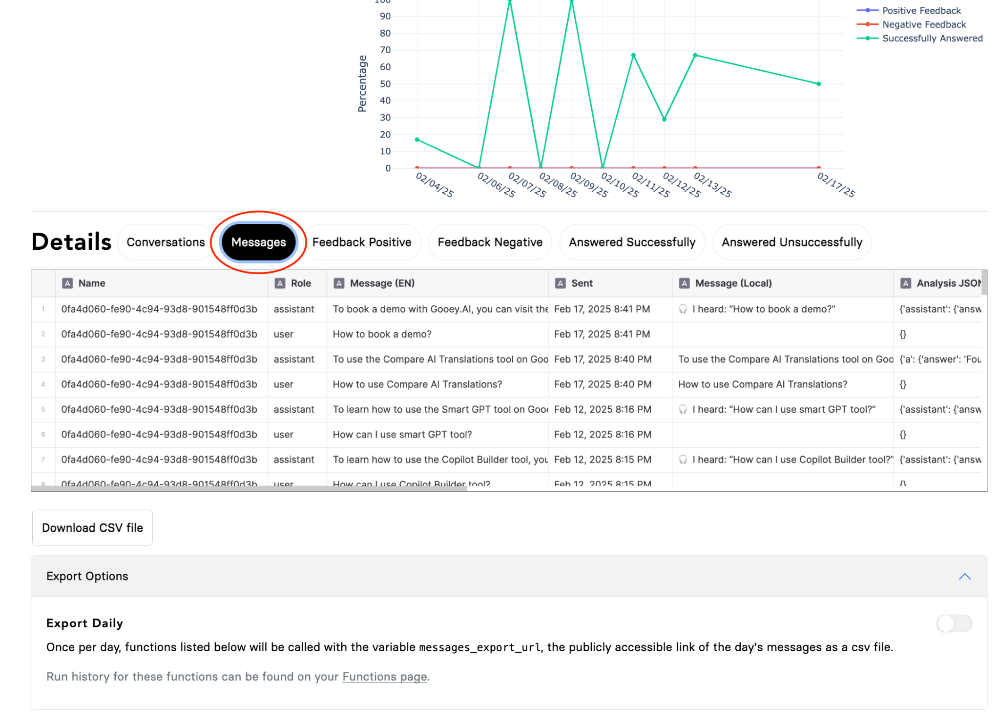
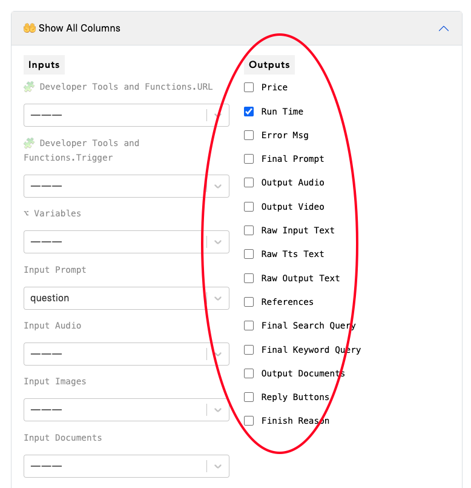

# 💪 How to set up Bulk Runner?

In this example scenario, we are setting up a simple bulk run to check regression for an AI Copilot in production.

<table data-view="cards"><thead><tr><th></th><th data-hidden data-card-target data-type="content-ref"></th></tr></thead><tbody><tr><td><strong>Check out the example run here: BULK RUNNER (Regression Only)</strong></td><td><a href="https://gooey.ai/bulk/farmerchat-bulk-evaluator-regression-only-ggzy9gld1eae/">https://gooey.ai/bulk/farmerchat-bulk-evaluator-regression-only-ggzy9gld1eae/</a></td></tr><tr><td><strong>Check out the example run here: BULK RUNNER (Bulk and Evaluation)</strong></td><td><a href="https://gooey.ai/bulk/farmerchat-bulk-evaluator-gpt-4o-mixtral-claude-vs-gemini-pro-15-b0o8aos3rj8y/">https://gooey.ai/bulk/farmerchat-bulk-evaluator-gpt-4o-mixtral-claude-vs-gemini-pro-15-b0o8aos3rj8y/</a></td></tr></tbody></table>



### Step 1: Select Gooey Workflows 

Choose the “SAVED” run from Gooey.AI Workflows that you would like to use.

### Step 2: Input Data Spreadsheet 

Prepare your test question set:

1. Create a list of the most frequently asked questions for your AI Copilot (we recommend between 25 for optimum observability and regression you can do more if you prefer)
2. Make sure the Excel sheet/Google Sheets table has a “header” section
3. Add all your questions in the column below it

<figure><figcaption></figcaption></figure>

1. Paste the link of your Google sheet or upload your data

&#x20;

<figure><figcaption></figcaption></figure>

### Step 3: Select your input columns 

In the current scenario, we want to use the Gooey Copilot to answer all the questions in the google sheet. So essentially they are the “input” for the Bulk Workflow.

Select the “questions” column in the “Input Prompt” section.

### Step 4: Hit Submit 

As this is a “Bulk only” scenario, you can “delete” the Copilot Evaluator option in the section. After that hit the “Submit” button.

&#x20;

<figure><figcaption></figcaption></figure>

### Output 

The workflow will create a new CSV, with an added few columns based on the run, including, “Output Text”, “Run URL”, and “Run Time”.

**Your output will be on the right side of the page.**

<figure><figcaption></figcaption></figure>

#### Additional Note 

If you want more details in the Output section, use the checkboxes in the “Show All Columns” section on the right. This is useful if you want to keep track of Price, Error Messages, and other details.

