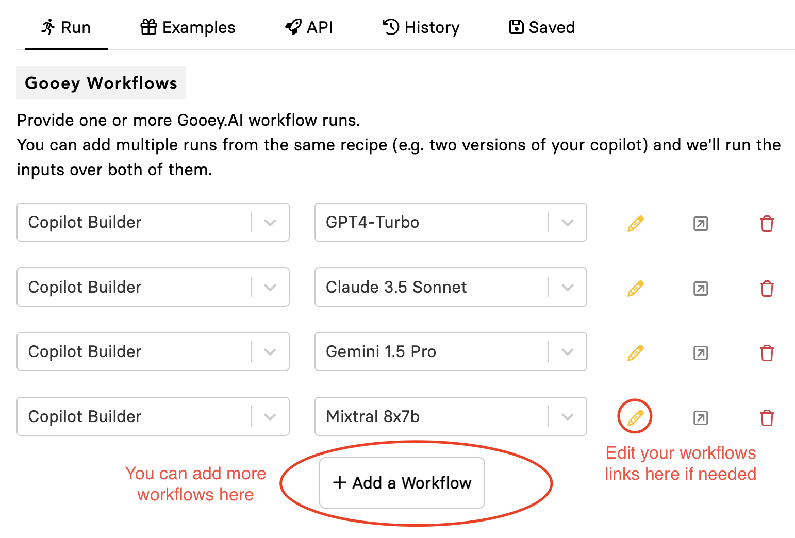
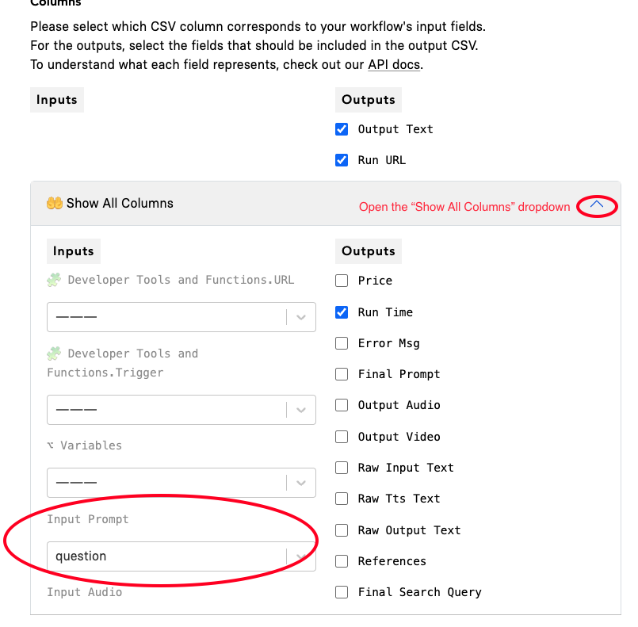

# 🕵️‍♀️ How to set up Evaluations?

In this example scenario, we are comparing and evaluating the quality of the answers of various AI Copilots that have all the same settings and functionalities except for different LLMs. 

### Step 1: Select Gooey Workflows to evaluate 

Choose the “SAVED” run from Gooey.AI Workflows that you would like to use.

### Step 2: Input Data Spreadsheet 

Prepare your golden QnA set:

1. Create a list of the most frequently asked questions for your AI Copilot (we recommend between 25 for optimum observability and regression you can do more if you prefer)
2. Make sure the Excel sheet/Google Sheets table has a “header” section
3. Add all your questions and golden answer in the column below it

<figure><figcaption></figcaption></figure>

**You must provide the Golden Answers. Golden answers are the most suitable and accurate answers provided by humans with expertise on the subject.**

1. Paste the link of your Google sheet or upload your data&#x20;

<figure><figcaption></figcaption></figure>

### Step 3: Select your input columns 

In the current scenario, we want to use the Gooey Copilot to answer all the questions in the Google sheet. So essentially they are the “input” for the Bulk Workflow.

Select the “questions” column in the “Input Prompt” section.

### Step 4: Hit Submit 

As this is a “Bulk and Eval” scenario, you can “select” the Copilot Evaluator option in the section. After that hit the “Submit” button.

_Note: We recommend using the “Copilot Evaluator” if you are evaluating Copilot Runs._

### Output 

The workflow will create a new CSV, with an added few columns based on the run, including, “Output Text”, “Run URL”, and “Run Time”.

_**With the evaluation option, you will also get output for “Rationale”, “Compare Run Score”, etc. You will also get a Compare Chart which will show the aggregate scores.**_

**Your output will be on the right side of the page.**

<figure><figcaption></figcaption></figure>

<figure><figcaption></figcaption></figure>

### Best Practices 

* Keep it simple - try to use an input spreadsheet with limited columns
* Don’t leave any empty data points in the second row - there is a bug and the column does not read
* Make sure to name your “Saved” workflows with relatable titles so that it is easy to set up the run
*   We recommend collecting user messages from your saved copilot's “Analytics” section. Head to Your copilot link> Integrations tab > View Analytics, scroll to the bottom, and **export** the “Messages” tab CSV. \

    <figure><figcaption></figcaption></figure>

#### Note: 

* Bulk runner will only read the first sheet of your Excel or Google Sheet
* In the case of Google Sheets, you can shift your relevant sheet to be the first and then re-enter the link in the Input section. IT WILL NOT REFRESH ON ITS OWN.
