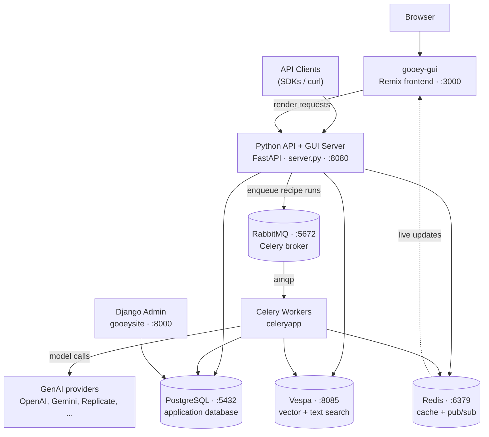

# What is Gooey Server?

[Gooey.AI](https://gooey.ai) is a low-code AI recipe platform, and **Gooey Server** is our core repo — the same code that runs [gooey.ai](https://gooey.ai) itself. It lets you discover, customize, and deploy AI "recipes" using the best of private and open-source AI, all behind a single API with a single auth token.

Recipes are workflows that chain models together to accomplish a task. They are designed to be highly customizable and shareable, and everything you can do on the hosted service you can also do on a server you run yourself.

The source lives at [github.com/GooeyAI/gooey-server](https://github.com/GooeyAI/gooey-server) under the [Apache-2.0 licence](https://github.com/GooeyAI/gooey-server/blob/master/LICENSE).

## Architecture

Gooey Server is four application processes running on top of four backing services.

### The components

| Component | What it does | Port |
| --------- | ------------ | ---- |
| **gooey-gui** (`gooey-gui/`) | Remix/React frontend. Asks the Python server to render each page as a JSON component tree, renders that in React, and subscribes to Redis pub/sub so pages update live while a recipe runs. | `3000` |
| **Python API + GUI Server** (`server.py`) | FastAPI app that serves the public API and the page-render endpoints used by gooey-gui. | `8080` |
| **Celery Workers** (`celeryapp/`) | Run the actual recipes: consume jobs from RabbitMQ, call the GenAI providers, save results to Postgres, and publish progress to Redis. | — |
| **Django Admin** (`gooeysite/`) | Admin UI over the same Postgres database — where you manage users, credits, and AI model specs. | `8000` |
| **PostgreSQL 15** | Application database. | `5432` |
| **Redis 8** | Cache and realtime pub/sub. | `6379` |
| **RabbitMQ** | Celery broker. | `5672` |
| **Vespa** | Vector and full-text search, powering document search / RAG. | `8085` |


All four backing services are open source, and a default install needs no cloud account at all. See [Platform Independence](platform-independence.md) for the full accounting.


## Why local and sovereign hosting matters

Running Gooey on your own infrastructure isn't only a developer convenience — for a lot of our users it's the whole point.

AI systems increasingly mediate healthcare advice, agricultural extension, education, and government services. When that infrastructure runs in someone else's data centre under someone else's terms, the communities being served have no say over how it behaves, what it costs, whether it understands their language, or whether it stays switched on.

Self-hosted Gooey Server is a practical answer to that:

* **Data stays where you put it.** Uploads, run history, and user records live in your Postgres and your filesystem. Nothing has to leave your network.
* **Models are your choice.** Point Gooey at [a model running on your own GPU](adding-local-ai-models.md) — Ollama, vLLM, LocalAI, llama.cpp — or at a regional provider, or at a frontier lab. Switching is a config change, not a rewrite.
* **No vendor can suspend you.** Every proprietary dependency is optional and off by default. The stack runs end to end on open-source components.
* **Workflows are portable.** Recipes built on a sovereign deployment can be shared with, and forked by, anyone else running the same open stack.


Our founders wrote about this at length in **[How Middle Powers Cooperate for AI Sovereignty](https://gooey.ai/sovereignty)** — the case that middle-power nations gain more from cooperating on open benchmarks, datasets, commoditised models, and shared workflows than from each building an isolated stack. Self-hosted Gooey Server is the piece of that argument you can actually run.


### Running with zero proprietary services

A default local install already avoids every closed-source dependency. Nothing in this table needs configuring to reach the "Default locally" column — that is what you get out of the box.

| Concern | Default locally | Turned on by |
| ------- | --------------- | ------------ |
| Auth | Local Django email/password (`routers/local_auth.py`) | `ENABLE_FIREBASE_AUTH` |
| File storage | Local filesystem under `MEDIA_ROOT` (`./media`) | `GS_BUCKET_NAME` |
| LLMs | Any OpenAI-compatible server via `AIModelSpec.base_url` | Provider API keys |
| STT / TTS / embeddings | Self-hosted Whisper, Seamless, MMS, Bark, E5/GTE on the GPU Celery worker | Provider API keys |
| Document OCR | Standard text extraction, no OCR | `AZURE_FORM_RECOGNIZER_KEY` or `MISTRAL_API_KEY` |
| Payments | Disabled; billing UI degrades gracefully and credits are granted via the admin | `STRIPE_SECRET_KEY` |
| Image moderation | Skipped | `AZURE_IMAGE_MODERATION_ENDPOINT` |
| Managed secrets | Disabled; pass keys to functions as env vars | `AZURE_KEY_VAULT_ENDPOINT` |
| Analytics | No script served | GTM ID |
| Messaging connectors | Disabled | `FB_APP_ID`, `TWILIO_ACCOUNT_SID`, `SLACK_CLIENT_ID` |

The backing services are PostgreSQL (PostgreSQL License), RabbitMQ (MPL-2.0), Vespa (Apache-2.0), and Redis 8 (used under its AGPL-3.0 option; [Valkey](https://valkey.io) is a drop-in alternative with no code changes). Gooey Server itself is Apache-2.0.

Full detail, including code references for each swap point, is in [Platform Independence](platform-independence.md).

## Where to go next

<table data-view="cards"><thead><tr><th></th><th></th><th data-hidden data-card-target data-type="content-ref"></th></tr></thead><tbody><tr><td><h4>Installation Guide</h4></td><td>Get a server running, with Docker or a full manual install</td><td><a href="installation/">installation</a></td></tr><tr><td><h4>Adding Local AI Models</h4></td><td>Point Gooey at Ollama, vLLM, or any OpenAI-compatible server</td><td><a href="adding-local-ai-models.md">adding-local-ai-models.md</a></td></tr><tr><td><h4>Configuration Reference</h4></td><td>Every environment variable, with defaults</td><td><a href="configuration.md">configuration.md</a></td></tr><tr><td><h4>Platform Independence</h4></td><td>How each proprietary dependency is made optional</td><td><a href="platform-independence.md">platform-independence.md</a></td></tr></tbody></table>
