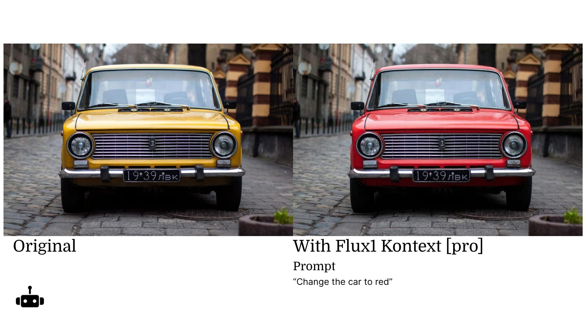
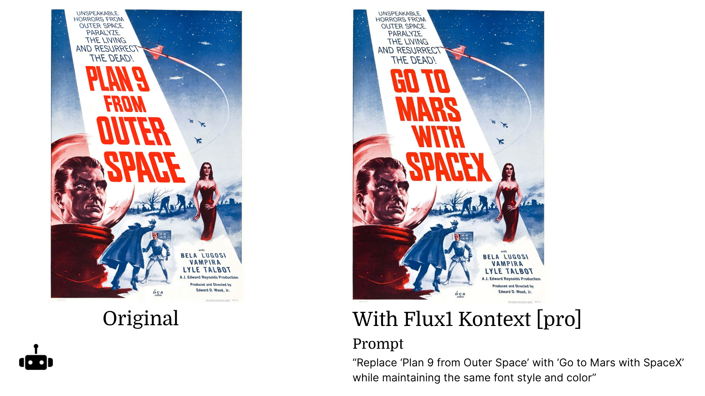

# FLUX.1 Kontext \[pro]

### Introduction 

FLUX.1 Kontext makes editing images easy! Use plain text prompting to specify what you want to change, and the model will follow. The model can understand the context of the image, making it easier to edit it without having to describe in detail what you want to do.

### Added Flux1 Kontext \[pro] 

We updated Flux1 Kontext \[pro] in our “Edit an Image” Workflow. You can use text prompts to edit any image you have.\

### Prompting Tips 

### Basic Modifications 

* Do: Be simple and direct
* Don’t: Complicate your prompt



### Changing Text 

* Do: Use the word “replace” or “change” to set the context for the model
* Do: Use “Double Quotes” for the text you want to change
* Do: Write phrases like “Maintain style” or “Preserve style.”
* Don’t: Write prompts that will change the context too much



### Editing an Image 

* Do: Mention the character, gender or animal species to retain the context, like “A beautiful anime drawing of **my pet dog**…”



### Changing character context 

* Do: Use “replace”
* Do: Specify gender “the man”



### Style Transfer 

* Do: Be direct and write “Use this style, a vintage computer”
* Don’t: Add too many details like “80s Apple II computer with table and wires” it will change the image too much



